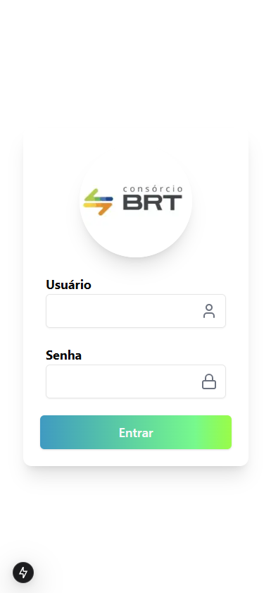
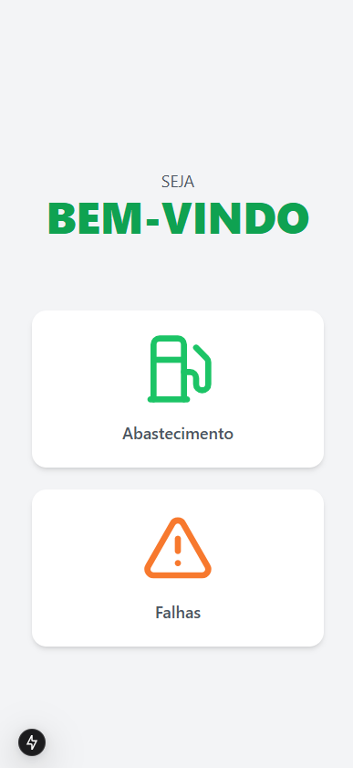
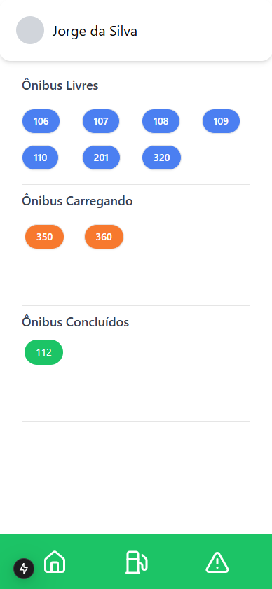
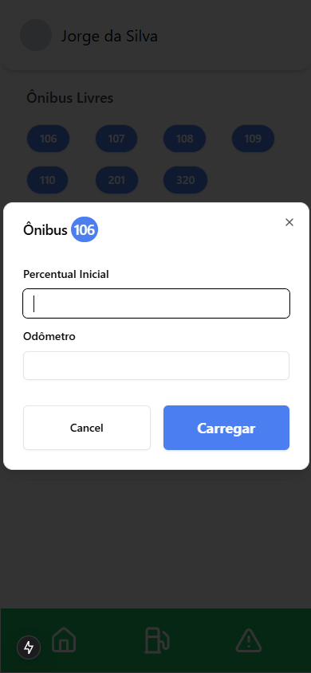
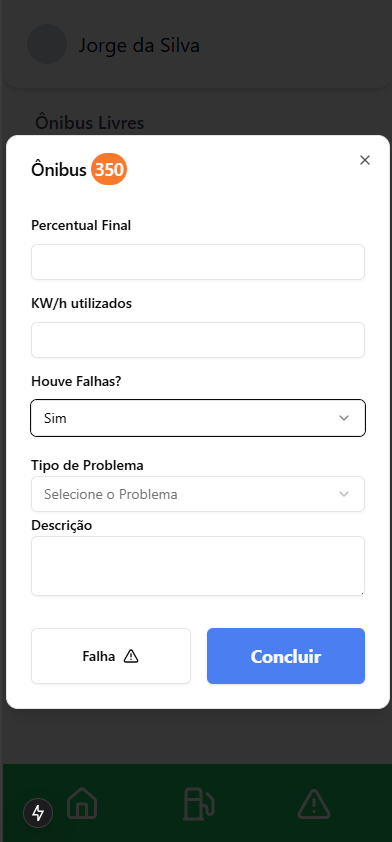
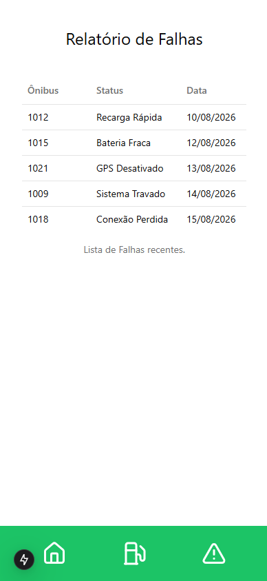
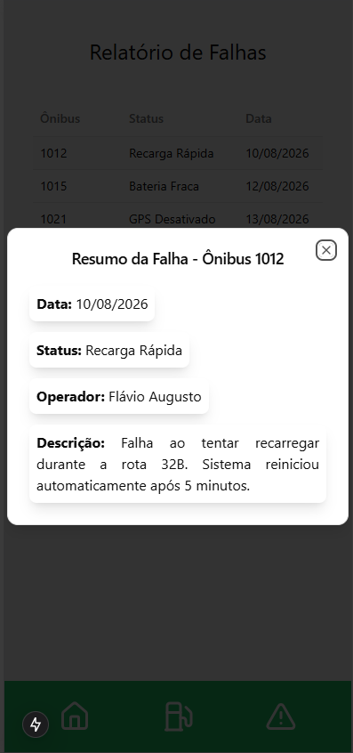

# Sistema de Controle de Recarga

### -> Esse é um Sistema onde irá fazer o controle das recargas usadas pelos operadores, onde terá tela de Login, Menu Principal, Tela de Abastecimento e de Falhas.

### -> Esse sistema está responsivo para todos os dispositivos móveis, com uma tela bem simples e intuitiva de ser utilizada.

---

# Funcionalidades

### Tela de Login
- Na tela de Login, quando o usuário fizer o login vai coletar as informações de onde o usuário está e gravar o nome do usuário no LocalStorage;



---
### Tela Home (Menu)
- Na tela de Home, será bem simples, onde irá aparecer apenas dois botões para o usuário clicar, botão de Abastecimento e botão de Falhas


---
### Tela de Abastecimento
- Na tela de Abastecimento, terá o Header (que irá mostrar o nome do usuário e avatar), três opções de Ônibus (Livres, Carregando e Concluídos);
- Os ônibus Livres e Carregando tem as opções de quando clicar no número do ônibus, irá aparecer um pop-up que irá mostrar para você preencher as informações.



- Aqui é quando clica nos botões azuis do Ônibus Livres:



- Aqui é quando clica nos botões laranjas do Ônibus Carregando:


---
### Tela de Falhas
- Na tela de Falhas, temos um Relatório de todas as Falhas que tiveram e irá mostrar qual foi o Ônibus, Status e a Data.
- Quando clicar em algum dessas linhas, irá aparecer mais informações, como o de qual operador que fez o registro da falha e qual foi o detalhe da falha ter acontecido.



- Aqui é quando clica na linha e mostra um pop-up dos detalhes:



# Organização do Projeto

```
├── app
    └── (auth)
        └── login
            ├── page.tsx
        ├── layout.tsx
    └── (root)
        └── home
            ├── page.tsx
        └── links
            └── abastecimento
                ├── page.tsx
            └── falhas
                ├── page.tsx
            ├── layout.tsx
        ├── favicon.ico
        ├── globals.css
        ├── layout.tsx
├── components
    ├── Abastecimento.tsx
    ├── Falhas.tsx
    ├── Footer.tsx
    ├── Header.tsx
    ├── Home.tsx
    ├── Login.tsx
├── lib
    └── utils.ts
├── public
    └── image
├── .gitignore
├── components.json
├── eslint.config.mjs
├── next-env.d.ts
├── next.config.ts
├── package-lock.json
├── package.json
├── postcss.config.mjs
├── README.md
├── tailwind.config.ts
├── tsconfig.json
```

# Instalação e Execução

## 1. Clone o repositório do Git Hub:

```bash
git clone https://github.com/ConsorcioBRT/Controle-Recarga.git
```

## 2. Instale as dependências

#### - Para instalar todas as dependências do projeto, basta colocar esse comando no terminal:

```bash
npm install
```

## 3. Inicie o projeto

#### - Para rodar o projeto, basta usar este comando no terminal e entrar no navegador e digitar `http://localhost:3000`:

```bash
npm run dev
```

---